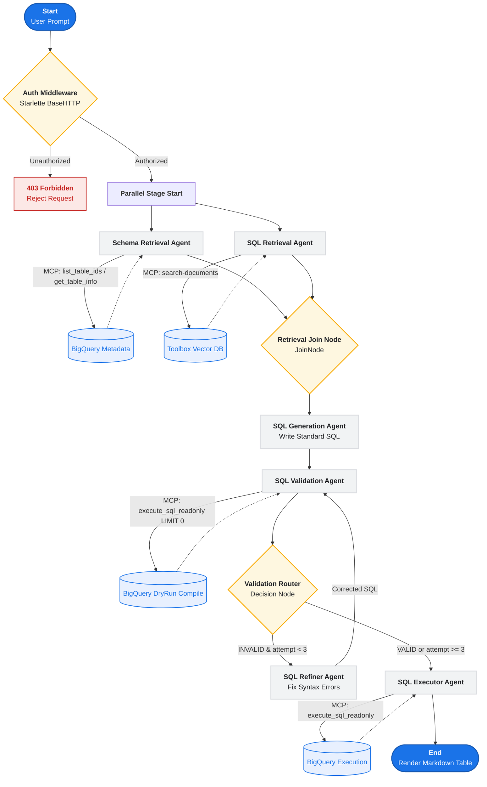
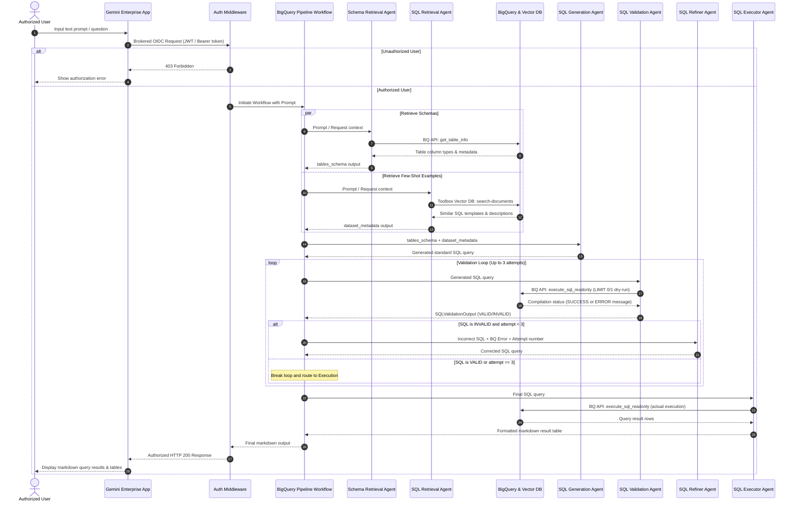

---

## 1. Membuat Dataset

Perintah ini akan membuat dataset di region Jakarta (`asia-southeast2`).

```sql
CREATE SCHEMA IF NOT EXISTS `healthcare_forecasting_jakarta`
OPTIONS(
  location = 'asia-southeast2',
  description = 'Dummy Healthcare Dataset for Jakarta Region for ML Forecasting'
);

```

---

## 2. Membuat Tabel `hospital_admissions_daily`

Tabel ini dikonfigurasi dengan:

* Partisi berdasarkan kolom `date` harian (`DAY`).
* Klasterisasi berdasarkan `hospital_name` dan `department` untuk mengoptimalkan performa query.

```sql
CREATE OR REPLACE TABLE `healthcare_forecasting_jakarta_v2.hospital_admissions_daily`
(
  date DATE NOT NULL,
  hospital_name STRING NOT NULL,
  department STRING NOT NULL,
  admissions_count INT64 NOT NULL,
  avg_wait_time_minutes FLOAT64,
  temperature_celsius FLOAT64,
  rainfall_mm FLOAT64,
  air_quality_index INT64,
  is_holiday INT64,
  is_weekend INT64
)
PARTITION BY date
CLUSTER BY hospital_name, department;
```

---

> **Catatan:** > * Penggunaan `CREATE OR REPLACE TABLE` akan menghapus tabel lama jika sudah ada (sama seperti efek `WRITE_TRUNCATE` pada script Python Anda). Jika Anda hanya ingin membuat tabel jika belum ada tanpa menghapus data lama, gantilah menjadi `CREATE TABLE IF NOT EXISTS`.
> * Tipe data `INTEGER` pada Python BigQuery SDK otomatis dikonversi menjadi `INT64` di BigQuery SQL, dan `FLOAT` menjadi `FLOAT64`.
> 
>

## 1. Query SQL `LOAD DATA`

Query ini akan membaca langsung berkas CSV dari Cloud Storage dan memasukkannya ke dalam tabel yang telah didefinisikan sebelumnya.

```sql
LOAD DATA OVERWRITE `healthcare_forecasting_jakarta_v2.hospital_admissions_daily`
(
  date DATE NOT NULL,
  hospital_name STRING NOT NULL,
  department STRING NOT NULL,
  admissions_count INT64 NOT NULL,
  avg_wait_time_minutes FLOAT64,
  temperature_celsius FLOAT64,
  rainfall_mm FLOAT64,
  air_quality_index INT64,
  is_holiday INT64,
  is_weekend INT64
)
PARTITION BY date
CLUSTER BY hospital_name, department
FROM FILES (
  format = 'CSV',
  uris = ['gs://healthcare-forecasting-jakarta-bucket/hospital_admissions_daily.csv'],
  skip_leading_rows = 1
);
```

### Penjelasan Parameter:

* **`OVERWRITE`**: Mengosongkan data lama di dalam tabel terlebih dahulu sebelum memasukkan data baru (berfungsi seperti *Write Truncate*). Jika Anda hanya ingin menambahkan data baru tanpa menghapus data yang sudah ada, ganti kata `OVERWRITE` menjadi **`APPEND`**:
```sql
LOAD DATA APPEND `healthcare_forecasting_jakarta_v2.hospital_admissions_daily` ...

```


* **`format = 'CSV'`**: Menentukan bahwa berkas sumber berformat CSV sesuai dengan generator data yang kita buat.
* **`uris`**: Lokasi penyimpanan berkas di GCS (disesuaikan dengan konfigurasi `BUCKET_NAME` dan `GCS_BLOB_NAME` pada berkas di **Canvas**).
* **`skip_header = 1`**: Mengabaikan baris pertama pada CSV karena baris tersebut merupakan nama kolom (header).

---

## Train Machine Learning Model

```sql
CREATE OR REPLACE MODEL `eikon-dev-ai-team.healthcare_forecasting_jakarta_v2.hospital_admissions_arima`
OPTIONS(
  model_type = 'ARIMA_PLUS',
  time_series_timestamp_col = 'date',
  time_series_data_col = 'admissions_count',
  time_series_id_col = ['hospital_name', 'department'],
  holiday_region = 'ID', -- BigQuery has built-in Indonesian holiday effects!
  clean_spikes_and_dips = TRUE,
  adjust_step_changes = TRUE
) AS
SELECT 
  date,
  hospital_name,
  department,
  admissions_count
FROM 
  `eikon-dev-ai-team.healthcare_forecasting_jakarta_v2.hospital_admissions_daily`
WHERE 
  date <= '2026-05-01';
```

Query ini bertujuan untuk **membuat dan melatih model forecasting time-series** menggunakan algoritma bawaan BigQuery, yaitu **ARIMA_PLUS**.

Berikut adalah penjelasan detail untuk setiap bagian dari query SQL tersebut:

---

### 1. Inisialisasi Pembuatan Model

```sql
CREATE OR REPLACE MODEL `eikon-dev-ai-team.healthcare_forecasting_jakarta_v2.hospital_admissions_arima`

```

* **Fungsi**: Membuat model baru bernama `hospital_admissions_arima` di dalam dataset `healthcare_forecasting_jakarta_v2`.
* **Sifat**: Jika model dengan nama tersebut sudah ada, klausa `OR REPLACE` akan menimpanya (menggantinya dengan versi yang baru dilatih).

---

### 2. Opsi Konfigurasi Model (`OPTIONS`)

Bagian ini mengatur bagaimana algoritma BigQuery ML harus memproses data deret waktu Anda.

* **`model_type = 'ARIMA_PLUS'`**
* Ini adalah algoritma *time-series* unggulan di BigQuery. Berbeda dengan ARIMA standar, `ARIMA_PLUS` secara otomatis melakukan serangkaian prapemrosesan (*preprocessing*) yang kompleks seperti mendeteksi tren, pola musiman (harian, mingguan, tahunan), mendeteksi anomali/outlier, dan memperhitungkan hari libur.


* **`time_series_timestamp_col = 'date'`**
* Menentukan kolom mana yang menjadi penunjuk waktu (sumbu X). Di sini kita menggunakan kolom `date`.


* **`time_series_data_col = 'admissions_count'`**
* Menentukan variabel numerik yang ingin kita ramalkan/prediksi nilainya di masa depan (jumlah admisi/pasien masuk).


* **`time_series_id_col = ['hospital_name', 'department']`**
* **Ini adalah fitur yang sangat kuat.** Alih-alih membuat satu model global untuk semua rumah sakit, BigQuery akan secara otomatis membuat **banyak model time-series terpisah** untuk setiap kombinasi unik dari nama rumah sakit dan departemennya (misalnya: model khusus untuk *RSUD Tarakan - Emergency Room*, model khusus untuk *RS Fatmawati - ICU*, dll.). Semuanya berjalan paralel hanya dalam satu query tunggal.


* **`holiday_region = 'ID'`**
* Mengintegrasikan kalender hari libur nasional **Indonesia (ID)** yang sudah disediakan oleh Google. BigQuery akan otomatis menyesuaikan prediksi naik-turunnya jumlah pasien berdasarkan efek hari libur nasional di Indonesia (seperti Lebaran, Tahun Baru, dll.).


* **`clean_spikes_and_dips = TRUE`**
* Mengaktifkan pembersihan data pencilan otomatis. Jika ada lonjakan (spikes) atau penurunan (dips) ekstrem yang bersifat anomali sementara (misalnya ada gangguan pencatatan sistem), model akan membersihkannya terlebih dahulu agar tidak merusak akurasi tren jangka panjang.


* **`adjust_step_changes = TRUE`**
* Menginstruksikan model untuk mendeteksi perubahan baseline permanen (*step changes*). Contoh: Jika sebuah rumah sakit tiba-tiba membuka gedung baru sehingga kapasitasnya melonjak permanen, model akan menyesuaikan baseline proyeksinya secara otomatis.


---

### 3. Data Masukan untuk Pelatihan (`AS SELECT ...`)

```sql
AS
SELECT 
  date,
  hospital_name,
  department,
  admissions_count
FROM 
  `eikon-dev-ai-team.healthcare_forecasting_jakarta_v2.hospital_admissions_daily`
WHERE 
  date <= '2026-05-01';

```

* **Fungsi**: Memilih kolom yang dibutuhkan dari tabel data harian rumah sakit yang telah di-ingest sebelumnya.
* **Strategi Pembatasan Tanggal (`WHERE date <= '2026-05-01'`)**:
* Di dalam script data generator, data Anda digenerate hingga **31 Mei 2026**.
* Dengan membatasi data pelatihan hanya sampai **1 Mei 2026**, Anda menyisakan data sisa (1 Mei hingga 31 Mei 2026) sebagai **holdout/test set** (data uji).
* Ini adalah praktik terbaik (*best practice*) dalam Data Science agar nantinya Anda bisa membandingkan hasil ramalan model di bulan Mei 2026 dengan data aktual yang sebenarnya guna mengukur tingkat akurasi (seperti nilai MAPE atau RMSE).

## 🤖 Agent System Architecture & Workflows

Our AI agent solution uses the **Google Agent Development Kit (ADK)** to orchestrate multiple sub-agents in a highly secured, parallelized pipeline. Below are the visual maps of how prompts are authorized, how data is retrieved, and how the multi-agent orchestration generates, refines, and executes queries.

### 📊 Agent Workflow Chart

This flowchart details how requests pass through the application-layer security gateway into the parallel retrieval stage, compile validation loop, refinement logic, and final database execution.



### 🔄 Agent Sequence Chart

This sequence diagram illustrates the temporal interactions, parallel processes, back-and-forth validation loops, and security boundaries across the lifetime of a single prompt execution.



### 📖 Step-by-Step Pipeline Execution

The system uses a highly structured, self-correcting multi-agent flow. Here is what happens under the hood during a single user query execution:

#### 1. Ingress & Application-Layer Authentication
* **Trigger**: An authorized user submits a natural-language query to the **Gemini Enterprise App**.
* **Request Route**: The request passes to our Cloud Run container as an HTTP POST request carrying Google-signed OIDC ID tokens.
* **Authentication Middleware**: A custom Starlette `BaseHTTPMiddleware` extracts user emails from identity headers (`X-Goog-Authenticated-User-Email` or through local JWT and Google TokenInfo API decoding).
* **Policy Check**: The email is matched against the `ALLOWED_INVOKERS` environment variable list.
  * *If Unauthorized*: Aborts the request immediately and returns an HTTP `403 Forbidden` response.
  * *If Authorized*: Resolves user identity and forwards the prompt to initiate the `bigquery_pipeline_workflow`.

#### 2. Parallel Context Retrieval
Upon initialization, the workflow launches two parallel branches to retrieve physical and semantic context:
* **Schema Retrieval (`schema_retrieval_agent`)**: Calls the BigQuery MCP tool `get_table_info` to inspect physical schemas of `hospital_admissions_daily` or `dengue_cases_weekly`.
* **Semantic SQL Search (`sql_retrieval_agent`)**: Conducts a semantic vector search (`search-documents` tool) against our remote Toolbox Vector DB to find matching multi-shot SQL query patterns from `sql_examples.json`.

#### 3. Context Merging & SQL Synthesis
* **Joining (`retrieval_join`)**: A specialized `JoinNode` blocks until both parallel retrieval agents complete, gathering their outputs into a single context.
* **Generation (`sql_generation_agent`)**: Fuses the table column structures and matching few-shot examples together. The agent writes a standard BigQuery SQL query matching the exact requirements.

#### 4. Compile-Time Validation & Refinement Loop
Rather than running queries blindly, the system validates the SQL on BigQuery prior to full execution:
* **Dry Run (`sql_validation_agent`)**: Runs a `LIMIT 0` or `LIMIT 1` dry-run check via the BigQuery MCP tool `execute_sql_readonly`. This forces the BigQuery compiler to validate syntax and table structures.
* **Routing Decision (`validation_router`)**:
  * **Success Path**: If the SQL is syntactically correct, the router directs the query to execution (`EXECUTION` route).
  * **Self-Correction Path**: If compilation errors are caught (e.g., column mismatches or missing keywords) and the loop counter is **under 3 attempts**, the router increments the counter and sends the query and compiler logs to the **SQL Refiner Agent** (`REFINEMENT` route).
* **Syntax Refinement (`sql_refiner_agent`)**: Resolves compile-time complaints, updates SQL definitions, and routes the fixed query back to the validation agent for re-compilation.

#### 5. Data Execution & Rendering
* **Execution (`sql_executor_agent`)**: Executes the finalized query against BigQuery.
* **Safety Constraint**: The Executor has strict instructions restricting operations solely to BigQuery read-only calls.
* **Formatting**: Translates raw database rows into a clean, markdown-formatted tables/results representation, which cascades back through the authentication gateway and renders directly in the user's Gemini Enterprise interface.

## Example Prompts & Indexed Questions

The workspace includes a set of 11 curated example prompts (stored in `sql_examples.json` and ingested into the vector database) to teach the SQL agent how to answer queries about the Jakarta healthcare dataset.