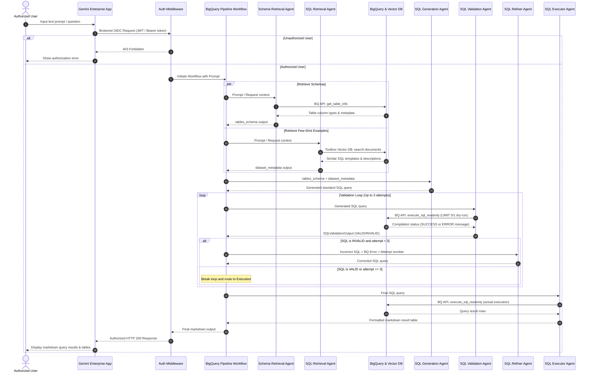

---

## 1. Membuat Dataset

Perintah ini akan membuat dataset di region Jakarta (`asia-southeast2`).

```sql
CREATE SCHEMA IF NOT EXISTS `healthcare_forecasting_jakarta`
OPTIONS(
  location = 'asia-southeast2',
  description = 'Dummy Healthcare Dataset for Jakarta Region for ML Forecasting'
);

```

---

## 2. Membuat Tabel `hospital_admissions_daily`

Tabel ini dikonfigurasi dengan:

* Partisi berdasarkan kolom `date` harian (`DAY`).
* Klasterisasi berdasarkan `hospital_name` dan `department` untuk mengoptimalkan performa query.

```sql
CREATE OR REPLACE TABLE `healthcare_forecasting_jakarta_v2.hospital_admissions_daily`
(
  date DATE NOT NULL,
  hospital_name STRING NOT NULL,
  department STRING NOT NULL,
  admissions_count INT64 NOT NULL,
  avg_wait_time_minutes FLOAT64,
  temperature_celsius FLOAT64,
  rainfall_mm FLOAT64,
  air_quality_index INT64,
  is_holiday INT64,
  is_weekend INT64
)
PARTITION BY date
CLUSTER BY hospital_name, department;
```

---

> **Catatan:** > * Penggunaan `CREATE OR REPLACE TABLE` akan menghapus tabel lama jika sudah ada (sama seperti efek `WRITE_TRUNCATE` pada script Python Anda). Jika Anda hanya ingin membuat tabel jika belum ada tanpa menghapus data lama, gantilah menjadi `CREATE TABLE IF NOT EXISTS`.
> * Tipe data `INTEGER` pada Python BigQuery SDK otomatis dikonversi menjadi `INT64` di BigQuery SQL, dan `FLOAT` menjadi `FLOAT64`.
> 
>

## 1. Query SQL `LOAD DATA`

Query ini akan membaca langsung berkas CSV dari Cloud Storage dan memasukkannya ke dalam tabel yang telah didefinisikan sebelumnya.

```sql
LOAD DATA OVERWRITE `healthcare_forecasting_jakarta_v2.hospital_admissions_daily`
(
  date DATE NOT NULL,
  hospital_name STRING NOT NULL,
  department STRING NOT NULL,
  admissions_count INT64 NOT NULL,
  avg_wait_time_minutes FLOAT64,
  temperature_celsius FLOAT64,
  rainfall_mm FLOAT64,
  air_quality_index INT64,
  is_holiday INT64,
  is_weekend INT64
)
PARTITION BY date
CLUSTER BY hospital_name, department
FROM FILES (
  format = 'CSV',
  uris = ['gs://healthcare-forecasting-jakarta-bucket/hospital_admissions_daily.csv'],
  skip_leading_rows = 1
);
```

### Penjelasan Parameter:

* **`OVERWRITE`**: Mengosongkan data lama di dalam tabel terlebih dahulu sebelum memasukkan data baru (berfungsi seperti *Write Truncate*). Jika Anda hanya ingin menambahkan data baru tanpa menghapus data yang sudah ada, ganti kata `OVERWRITE` menjadi **`APPEND`**:
```sql
LOAD DATA APPEND `healthcare_forecasting_jakarta_v2.hospital_admissions_daily` ...

```


* **`format = 'CSV'`**: Menentukan bahwa berkas sumber berformat CSV sesuai dengan generator data yang kita buat.
* **`uris`**: Lokasi penyimpanan berkas di GCS (disesuaikan dengan konfigurasi `BUCKET_NAME` dan `GCS_BLOB_NAME` pada berkas di **Canvas**).
* **`skip_header = 1`**: Mengabaikan baris pertama pada CSV karena baris tersebut merupakan nama kolom (header).

---

## Train Machine Learning Model

```sql
CREATE OR REPLACE MODEL `eikon-dev-ai-team.healthcare_forecasting_jakarta_v2.hospital_admissions_arima`
OPTIONS(
  model_type = 'ARIMA_PLUS',
  time_series_timestamp_col = 'date',
  time_series_data_col = 'admissions_count',
  time_series_id_col = ['hospital_name', 'department'],
  holiday_region = 'ID',
  clean_spikes_and_dips = TRUE,
  adjust_step_changes = TRUE
) AS
SELECT 
  date,
  hospital_name,
  department,
  admissions_count
FROM 
  `eikon-dev-ai-team.healthcare_forecasting_jakarta_v2.hospital_admissions_daily`
WHERE 
  date <= '2026-05-01';
```

Query ini bertujuan untuk **membuat dan melatih model forecasting time-series** menggunakan algoritma bawaan BigQuery, yaitu **ARIMA_PLUS**.

Berikut adalah penjelasan detail untuk setiap bagian dari query SQL tersebut:

---

### 1. Inisialisasi Pembuatan Model

```sql
CREATE OR REPLACE MODEL `eikon-dev-ai-team.healthcare_forecasting_jakarta_v2.hospital_admissions_arima`

```

* **Fungsi**: Membuat model baru bernama `hospital_admissions_arima` di dalam dataset `healthcare_forecasting_jakarta_v2`.
* **Sifat**: Jika model dengan nama tersebut sudah ada, klausa `OR REPLACE` akan menimpanya (menggantinya dengan versi yang baru dilatih).

---

### 2. Opsi Konfigurasi Model (`OPTIONS`)

Bagian ini mengatur bagaimana algoritma BigQuery ML harus memproses data deret waktu Anda.

* **`model_type = 'ARIMA_PLUS'`**
* Ini adalah algoritma *time-series* unggulan di BigQuery. Berbeda dengan ARIMA standar, `ARIMA_PLUS` secara otomatis melakukan serangkaian prapemrosesan (*preprocessing*) yang kompleks seperti mendeteksi tren, pola musiman (harian, mingguan, tahunan), mendeteksi anomali/outlier, dan memperhitungkan hari libur.


* **`time_series_timestamp_col = 'date'`**
* Menentukan kolom mana yang menjadi penunjuk waktu (sumbu X). Di sini kita menggunakan kolom `date`.


* **`time_series_data_col = 'admissions_count'`**
* Menentukan variabel numerik yang ingin kita ramalkan/prediksi nilainya di masa depan (jumlah admisi/pasien masuk).


* **`time_series_id_col = ['hospital_name', 'department']`**
* **Ini adalah fitur yang sangat kuat.** Alih-alih membuat satu model global untuk semua rumah sakit, BigQuery akan secara otomatis membuat **banyak model time-series terpisah** untuk setiap kombinasi unik dari nama rumah sakit dan departemennya (misalnya: model khusus untuk *RSUD Tarakan - Emergency Room*, model khusus untuk *RS Fatmawati - ICU*, dll.). Semuanya berjalan paralel hanya dalam satu query tunggal.


* **`holiday_region = 'ID'`**
* Mengintegrasikan kalender hari libur nasional **Indonesia (ID)** yang sudah disediakan oleh Google. BigQuery akan otomatis menyesuaikan prediksi naik-turunnya jumlah pasien berdasarkan efek hari libur nasional di Indonesia (seperti Lebaran, Tahun Baru, dll.).


* **`clean_spikes_and_dips = TRUE`**
* Mengaktifkan pembersihan data pencilan otomatis. Jika ada lonjakan (spikes) atau penurunan (dips) ekstrem yang bersifat anomali sementara (misalnya ada gangguan pencatatan sistem), model akan membersihkannya terlebih dahulu agar tidak merusak akurasi tren jangka panjang.


* **`adjust_step_changes = TRUE`**
* Menginstruksikan model untuk mendeteksi perubahan baseline permanen (*step changes*). Contoh: Jika sebuah rumah sakit tiba-tiba membuka gedung baru sehingga kapasitasnya melonjak permanen, model akan menyesuaikan baseline proyeksinya secara otomatis.


---

### 3. Data Masukan untuk Pelatihan (`AS SELECT ...`)

```sql
AS
SELECT 
  date,
  hospital_name,
  department,
  admissions_count
FROM 
  `eikon-dev-ai-team.healthcare_forecasting_jakarta_v2.hospital_admissions_daily`
WHERE 
  date <= '2026-05-01';

```

* **Fungsi**: Memilih kolom yang dibutuhkan dari tabel data harian rumah sakit yang telah di-ingest sebelumnya.
* **Strategi Pembatasan Tanggal (`WHERE date <= '2026-05-01'`)**:
* Di dalam script data generator, data Anda digenerate hingga **31 Mei 2026**.
* Dengan membatasi data pelatihan hanya sampai **1 Mei 2026**, Anda menyisakan data sisa (1 Mei hingga 31 Mei 2026) sebagai **holdout/test set** (data uji).
* Ini adalah praktik terbaik (*best practice*) dalam Data Science agar nantinya Anda bisa membandingkan hasil ramalan model di bulan Mei 2026 dengan data aktual yang sebenarnya guna mengukur tingkat akurasi (seperti nilai MAPE atau RMSE).

---
## Evaluasi

###  1. 12 Baris (Rows 1-12 of 12)

Jumlah 12 baris ini terbentuk karena pada konfigurasi query pembuatan model, kita menggunakan parameter:
`time_series_id_col = ['hospital_name', 'department']`

Dalam generator data kita, terdapat **4 Rumah Sakit** dan **3 Departemen**. BigQuery secara otomatis memecah data tersebut menjadi **12 deret waktu (*time series*) yang unik** (4 RS $\times$ 3 Departemen = 12 kombinasi) dan melatih 12 model ARIMA secara paralel. Setiap baris pada tabel ini mewakili hasil evaluasi dari satu model spesifik untuk kombinasi RS dan Departemen tertentu.

---

### 2. Penjelasan Kolom-Kolom Tabel Evaluasi

Kolom-kolom ini menunjukkan arsitektur terbaik yang dipilih secara otomatis oleh BigQuery (*Auto-ARIMA*) serta metrik statistik performa untuk masing-masing dari 12 model tersebut:

* **`Non Seasonal P` ($p$)**: Menunjukkan ordo *Autoregressive* (AR) bagian non-musiman. Nilai `1` berarti nilai hari ini dipengaruhi oleh 1 hari sebelumnya. Nilai `0` berarti tidak ada pengaruh langsung dari hari sebelumnya secara non-musiman.
* **`Non Seasonal D` ($d$)**: Menunjukkan tingkat *Differencing* (pembedaan) untuk membuat data menjadi stasioner. Semua model menunjukkan nilai `1`, yang berarti data membutuhkan 1 kali proses pengurangan dengan hari sebelumnya agar trennya stabil.
* **`Non Seasonal Q` ($q$)**: Menunjukkan ordo *Moving Average* (MA) bagian non-musiman. Nilai `1` menunjukkan model menggunakan rata-rata bergerak dari 1 error historis sebelumnya untuk memperbaiki prediksi.
* **`Has Drift`**: Berfungsi untuk mendeteksi apakah tren data memiliki kecenderungan naik/turun yang konstan secara jangka panjang (*drift*). Di sini semua bernilai `False`.
* **`Has Spikes And Dips`**: Menunjukkan apakah BigQuery mendeteksi dan membersihkan pencilan (*outliers*) berupa lonjakan (*spikes*) atau penurunan tajam (*dips*) ekstrem yang tidak wajar sebelum melatih model. Beberapa model bernilai `True` (outlier berhasil dihilangkan) dan beberapa `False`.
* **`Has Holiday Effect`**: Semua baris bernilai **`True`**. Ini membuktikan konfigurasi `holiday_region = 'ID'` berhasil diterapkan. Model secara otomatis menyesuaikan prediksinya dengan pola hari libur nasional di Indonesia.
* **`Has Step Changes`**: Menunjukkan apakah model mendeteksi adanya perubahan tingkat (*level*) dasar data secara permanen. Misalnya, jika jumlah pasien tiba-tiba naik permanen karena ada penambahan fasilitas baru.
* **`Log Likelihood`**: Ukuran seberapa cocok model dengan data latih (semakin mendekati 0 atau semakin besar nilainya secara aljabar, semakin baik).
* **`AIC` (Akaike Information Criterion)**: Metrik untuk mengukur kualitas model dengan mempertimbangkan kompleksitasnya. **Semakin rendah nilai AIC, semakin baik dan efisien model tersebut.**
* **`Variance`**: Menunjukkan varians dari *residual* (error prediksi). Nilai varians yang kecil (seperti `6.973` atau `8.771`) menunjukkan tingkat akurasi prediksi model tersebut sangat tinggi dibandingkan yang bervarians besar (seperti `157.507`).
* **`Seasonal Period`**: Pola musiman yang berhasil dideteksi secara otomatis oleh BigQuery:
* `Weekly, Yearly`: Model mendeteksi adanya pola musiman mingguan (misal: Outpatient tutup di hari Minggu) dan tahunan (misal: siklus musim hujan/kemarau di Jakarta).
* `Weekly`: Hanya memiliki pola mingguan berulang.
* `No Seasonality`: Data cenderung flat atau acak tanpa pola musiman yang konsisten (biasanya terjadi pada departemen ICU yang kedatangan pasiennya tidak terduga).

---

## Evaluasi terhadap data Mei 2026
```sql
SELECT
  *
FROM
  ML.EVALUATE(
    MODEL `eikon-dev-ai-team.healthcare_forecasting_jakarta_v2.hospital_admissions_arima`,
    (
      SELECT 
        date,
        hospital_name,
        department,
        admissions_count
      FROM 
        `eikon-dev-ai-team.healthcare_forecasting_jakarta_v2.hospital_admissions_daily`
      WHERE 
        date > '2026-05-01'
    ),
    STRUCT(30 AS horizon, TRUE AS perform_aggregation)
  );

```

query `ML.EVALUATE` khusus ini digunakan untuk menguji seberapa akurat prediksi model jika diadu dengan **data riil yang baru (data holdout/test set)**.

Berikut adalah penjelasan detail untuk setiap komponen di dalam query tersebut:

---

### 1. Fungsi Utama: `ML.EVALUATE`

Fungsi bawaan (*built-in function*) BigQuery ML ini digunakan untuk menghitung metrik evaluasi model. Khusus untuk model berjenis `ARIMA_PLUS`, `ML.EVALUATE` akan menghitung seberapa besar tingkat *error* atau kesalahan prediksi model terhadap data aktual yang Anda sediakan.

---

### 2. Argumen Pertama: Objek Model

```sql
MODEL `eikon-dev-ai-team.healthcare_forecasting_jakarta_v2.hospital_admissions_arima`

```

Argumen ini memberi tahu BigQuery model mana yang ingin dievaluasi. Di sini, Anda memanggil model time-series rumah sakit Jakarta yang sudah dibuat pada langkah sebelumnya.

---

### 3. Argumen Kedua: Data Uji (*Evaluation Data*)

```sql
(
  SELECT 
    date,
    hospital_name,
    department,
    admissions_count
  FROM 
    `eikon-dev-ai-team.healthcare_forecasting_jakarta_v2.hospital_admissions_daily`
  WHERE 
    date > '2026-05-01'
)

```

Ini adalah bagian yang sangat krusial. Perhatikan klausa **`WHERE date > '2026-05-01'`**.

* Saat membuat model, Anda hanya menggunakan data **sampai tanggal 1 Mei 2026** sebagai data latih (*training set*).
* Di query ini, Anda memasukkan data **setelah tanggal 1 Mei 2026** (data bulan Mei yang tersisa) sebagai data uji (*test set*).
* Model akan diminta meramal untuk tanggal-tanggal di bulan Mei tersebut, lalu BigQuery akan membandingkan hasil ramalan tersebut dengan nilai `admissions_count` aktual yang ada di dalam tabel ini.

---

### 4. Argumen Ketiga: Parameter Tambahan (`STRUCT`)

```sql
STRUCT(30 AS horizon, TRUE AS perform_aggregation)

```

Bagian ini mengatur bagaimana proses evaluasi dihitung secara teknis:

* **`30 AS horizon`**: Menginstruksikan model untuk mengevaluasi prediksi hingga **30 langkah (hari) ke depan** terhitung sejak titik akhir data latih (artinya, meramal sepanjang bulan Mei 2026).
* **`TRUE AS perform_aggregation`**:
* Jika disetel `TRUE`, BigQuery akan merata-ratakan seluruh *error* prediksi selama 30 hari tersebut dan mengembalikan **1 baris evaluasi saja untuk setiap kombinasi rumah sakit & departemen**.
* Jika disetel `FALSE`, BigQuery akan menampilkan performa *error* hari demi hari secara detail (misal: *error* di hari ke-1 berapa, hari ke-2 berapa, s.d hari ke-30).

---
## Penjelasan Metrik Evaluasi

### 1. Panduan Singkat Membaca Metrik Evaluasi

* **MAE (*Mean Absolute Error*)**: Menunjukkan rata-rata selisih mutlak (jarak) antara prediksi model dengan jumlah pasien riil dalam satuan **orang/hari**.
* **RMSE (*Root Mean Squared Error*)**: Mirip seperti MAE, tetapi memberikan penalti berat pada error yang besar. Jika nilai RMSE jauh lebih tinggi dari MAE, berarti model sempat kecolongan membuat eror prediksi yang sangat besar di hari-hari tertentu (misalnya saat ada lonjakan pasien dadakan).
* **MAPE (*Mean Absolute Percentage Error*)**: Mengukur persentase rata-rata error. **Formula akurasinya adalah $100\% - \text{MAPE}$**. Nilai di bawah 20% dianggap sangat baik, 20%-50% cukup baik.
* **MASE (*Mean Absolute Scaled Error*)**: Metrik terbaik untuk membandingkan performa antar-departemen. Jika **$\text{MASE} < 1$**, berarti model ARIMA_PLUS Anda **jauh lebih pintar** dan akurat dibandingkan tebakan model dasar (*naive baseline*—seperti menebak bahwa jumlah pasien hari ini akan persis sama dengan kemarin).

### 2. Analisis Berdasarkan Departemen (Insight Utama)

Jika kita kelompokkan data di atas berdasarkan departemen, kita akan menemukan karakteristik unik dari performa model:

#### Emergency Room (Instalasi Gawat Darurat) — *Performa Terbaik!*

* **Rentang MAPE**: **10.4% – 16.3%** (Artinya akurasi model mencapai **83.7% hingga 89.6%**).
* **Analisis**: Model bekerja sangat akurat di UGD. Sebagai contoh, di **RS Fatmawati UGD**, nilai MAE-nya adalah `7.8`. Artinya, jika model menebak akan ada 50 pasien UGD besok, jumlah aslinya di lapangan melesetnya hanya berkisar antara 42 sampai 58 pasien. Nilai MASE seluruh UGD berada di bawah 1 (`0.70 - 0.89`), membuktikan model ini sangat andal.

#### ICU (Intensive Care Unit) — *Error Kecil secara Angka, tapi Persentase Tinggi*

* **Rentang MAE**: **2.1 – 3.3 orang per hari**.
* **Rentang MAPE**: **25.8% – 50.5%**.
* **Analisis**: Jangan terkecoh oleh tingginya angka MAPE di ICU (terutama RSUD Pasar Minggu yang menyentuh 50.5%). Di ICU, jumlah pasien harian memang sangat sedikit (misal rata-rata hanya 4-6 orang sehari). Jika model menebak 4 pasien padahal aslinya 2 pasien, secara angka mutlak melesetnya cuma **2 orang (MAE sangat kecil)**, namun secara persentase erornya langsung **50%**. Model tetap dinilai sukses karena MASE mayoritas berada di kisaran `0.59 - 0.77`.

#### Outpatient (Poliklinik/Rawat Jalan) — *Tantangan Terbesar Model*

* **Rentang MAE**: **7.5 – 13.4 orang per hari**.
* **Rentang MAPE**: **17.7% – 58.0%**.
* **Analisis**: Departemen Rawat Jalan memiliki volume pasien paling besar dan fluktuatif (sangat ramai di hari Senin, turun di akhir pekan, dan tutup saat hari libur).
* **RSUD Cengkareng** memiliki performa terbaik di kelas rawat jalan dengan MAPE hanya `17.7%`.
* **RSUD Tarakan** memiliki MAPE tertinggi (`58%`). Ini menandakan adanya pola fluktuasi ekstrem di RSUD Tarakan pada bulan Mei 2026 yang belum sepenuhnya tertangkap dengan mulus oleh model, meskipun nilai MASE-nya `0.84` (masih lebih baik daripada model tebakan biasa).

---

### 3. Kesimpulan Evaluasi Untuk Anda

Jika Anda harus mempresentasikan hasil ini kepada manajemen rumah sakit, berikut adalah poin kesimpulannya:

1. **Model Siap Dipakai**: Nilai **MASE < 1** pada 11 dari 12 kombinasi membuktikan bahwa BigQuery ARIMA_PLUS ini sangat layak digunakan untuk perencanaan logistik obat dan penjadwalan tenaga medis harian.
2. **Fokus Pembenahan**: Departemen *Outpatient* (Rawat Jalan) di RSUD Tarakan perlu diperiksa lebih lanjut. Anda bisa meningkatkan akurasinya di masa depan dengan menambahkan variabel eksternal tambahan (seperti jadwal rotasi dokter spesifik) jika diperlukan.
---
## Prediction

```sql
SELECT
  hospital_name,
  department,
  forecast_timestamp,
  ROUND(forecast_value) AS forecasted_admissions,
  ROUND(prediction_interval_lower_bound) AS lower_bound,
  ROUND(prediction_interval_upper_bound) AS upper_bound
FROM
  ML.FORECAST(
    MODEL `eikon-dev-ai-team.healthcare_forecasting_jakarta_v2.hospital_admissions_arima`,
    STRUCT(30 AS horizon, 0.90 AS confidence_level)
  )
ORDER BY
  hospital_name,
  department,
  forecast_timestamp;
```

### 1. Fungsi Utama: `ML.FORECAST`

Fungsi bawaan BigQuery ML ini digunakan khusus untuk model deret waktu (*time-series*) seperti `ARIMA_PLUS`. Fungsi ini bertugas mengeksekusi model yang sudah dilatih untuk memproyeksikan nilai-nilai ke masa depan (masa yang belum terjadi di dalam data pelatihan).

Di dalam fungsi ini, terdapat dua parameter penting:

* **`MODEL ...hospital_admissions_arima`**: Menentukan model mana yang digunakan sebagai otak untuk melakukan prediksi.
* **`STRUCT(30 AS horizon, 0.90 AS confidence_level)`**:
* **`30 AS horizon`**: Menginstruksikan model untuk meramal hingga **30 hari ke depan** dari titik data terakhir yang tersedia.
* **`0.90 AS confidence_level`**: Menentukan tingkat kepercayaan (90%) untuk batas atas dan batas bawah prediksi. Artinya, model mendesain rentang prediksi di mana ia 90% yakin bahwa jumlah pasien riil di lapangan nantinya akan jatuh di dalam rentang tersebut.


---

### 2. Kolom yang Dipilih (`SELECT`)

Hasil mentah dari `ML.FORECAST` sebenarnya mengeluarkan banyak kolom statistik teknis. Query Anda melakukan *filtering* dan pembulatan agar outputnya bersih dan mudah dibaca oleh tim operasional rumah sakit:

* **`hospital_name` & `department**`: Menunjukkan identitas rumah sakit dan poliklinik mana yang sedang diramal.
* **`forecast_timestamp`**: Tanggal di masa depan tempat prediksi tersebut berlaku (Hari ke-1, Hari ke-2, hingga Hari ke-30).
* **`ROUND(forecast_value) AS forecasted_admissions`**: Ini adalah **angka prediksi utama**. Karena jumlah pasien/manusia tidak mungkin berbentuk desimal (misal 45.7 orang), fungsi `ROUND` digunakan untuk membulatkannya ke satuan terdekat menjadi bilangan bulat (menjadi 46 orang).
* **`ROUND(prediction_interval_lower_bound) AS lower_bound`**: Batas bawah prediksi (skenario ter-sepi).
* **`ROUND(prediction_interval_upper_bound) AS upper_bound`**: Batas atas prediksi (skenario ter-ramai).

> **Mengapa Batas Atas dan Bawah Penting?**
> Jika untuk tanggal besok `forecasted_admissions` adalah **50**, dengan `lower_bound` **40** dan `upper_bound` **65**, maka manajemen rumah sakit bisa bersiap-siap: *minimal* menyediakan logistik untuk 40 pasien, dan menyiapkan kapasitas darurat hingga 65 pasien.

---

### 3. Pengurutan Data (`ORDER BY`)

```sql
ORDER BY
  hospital_name,
  department,
  forecast_timestamp;

```

Bagian ini memastikan hasil prediksi disajikan secara rapi dan berurutan. Data akan dikelompokkan per rumah sakit dahulu, lalu per departemen di dalam rumah sakit tersebut, dan barisnya diurutkan kronologis dari tanggal terdekat hingga tanggal terjauh (hari ke-1 sampai hari ke-30).

---
## 🤖 Agent System Architecture & Workflows

Our AI agent solution uses the **Google Agent Development Kit (ADK)** to orchestrate multiple sub-agents in a highly secured, parallelized pipeline. Below are the visual maps of how prompts are authorized, how data is retrieved, and how the multi-agent orchestration generates, refines, and executes queries.

### 📊 Agent Workflow Chart

This flowchart details how requests pass through the application-layer security gateway into the parallel retrieval stage, compile validation loop, refinement logic, and final database execution.


### 🔄 Agent Sequence Chart

This sequence diagram illustrates the temporal interactions, parallel processes, back-and-forth validation loops, and security boundaries across the lifetime of a single prompt execution.



### 📖 Step-by-Step Pipeline Execution

The system uses a highly structured, self-correcting multi-agent flow. Here is what happens under the hood during a single user query execution:

#### 1. Ingress & Application-Layer Authentication
* **Trigger**: An authorized user submits a natural-language query to the **Gemini Enterprise App**.
* **Request Route**: The request passes to our Cloud Run container as an HTTP POST request carrying Google-signed OIDC ID tokens.
* **Authentication Middleware**: A custom Starlette `BaseHTTPMiddleware` extracts user emails from identity headers (`X-Goog-Authenticated-User-Email` or through local JWT and Google TokenInfo API decoding).
* **Policy Check**: The email is matched against the `ALLOWED_INVOKERS` environment variable list.
  * *If Unauthorized*: Aborts the request immediately and returns an HTTP `403 Forbidden` response.
  * *If Authorized*: Resolves user identity and forwards the prompt to initiate the `bigquery_pipeline_workflow`.

#### 2. Parallel Context Retrieval
Upon initialization, the workflow launches two parallel branches to retrieve physical and semantic context:
* **Schema Retrieval (`schema_retrieval_agent`)**: Calls the BigQuery MCP tool `get_table_info` to inspect physical schemas of `hospital_admissions_daily` or `dengue_cases_weekly`.
* **Semantic SQL Search (`sql_retrieval_agent`)**: Conducts a semantic vector search (`search-documents` tool) against our remote Toolbox Vector DB to find matching multi-shot SQL query patterns from `sql_examples.json`.

#### 3. Context Merging & SQL Synthesis
* **Joining (`retrieval_join`)**: A specialized `JoinNode` blocks until both parallel retrieval agents complete, gathering their outputs into a single context.
* **Generation (`sql_generation_agent`)**: Fuses the table column structures and matching few-shot examples together. The agent writes a standard BigQuery SQL query matching the exact requirements.

#### 4. Compile-Time Validation & Refinement Loop
Rather than running queries blindly, the system validates the SQL on BigQuery prior to full execution:
* **Dry Run (`sql_validation_agent`)**: Runs a `LIMIT 0` or `LIMIT 1` dry-run check via the BigQuery MCP tool `execute_sql_readonly`. This forces the BigQuery compiler to validate syntax and table structures.
* **Routing Decision (`validation_router`)**:
  * **Success Path**: If the SQL is syntactically correct, the router directs the query to execution (`EXECUTION` route).
  * **Self-Correction Path**: If compilation errors are caught (e.g., column mismatches or missing keywords) and the loop counter is **under 3 attempts**, the router increments the counter and sends the query and compiler logs to the **SQL Refiner Agent** (`REFINEMENT` route).
* **Syntax Refinement (`sql_refiner_agent`)**: Resolves compile-time complaints, updates SQL definitions, and routes the fixed query back to the validation agent for re-compilation.

#### 5. Data Execution & Rendering
* **Execution (`sql_executor_agent`)**: Executes the finalized query against BigQuery.
* **Safety Constraint**: The Executor has strict instructions restricting operations solely to BigQuery read-only calls.
* **Formatting**: Translates raw database rows into a clean, markdown-formatted tables/results representation, which cascades back through the authentication gateway and renders directly in the user's Gemini Enterprise interface.

## Example Prompts & Indexed Questions

The workspace includes a set of 11 curated example prompts (stored in `sql_examples.json` and ingested into the vector database) to teach the SQL agent how to answer queries about the Jakarta healthcare dataset.