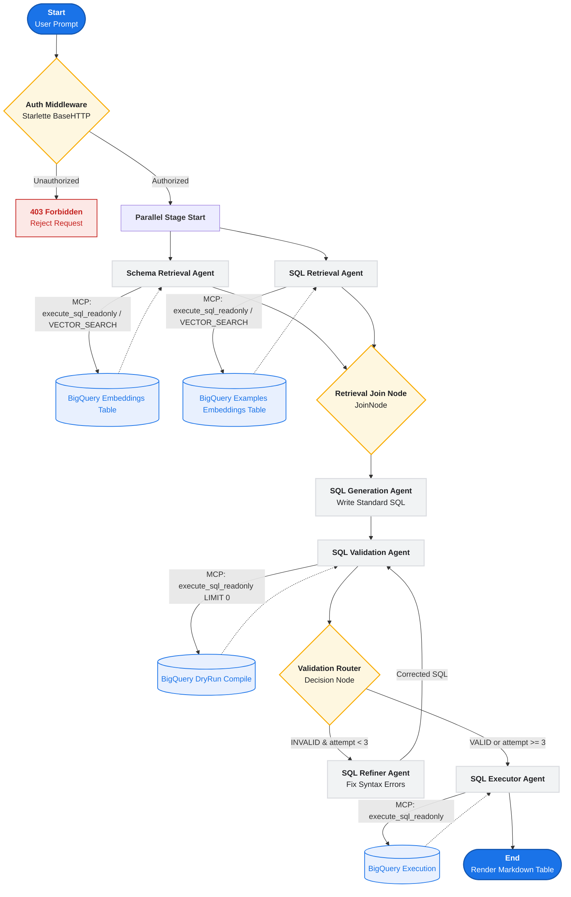
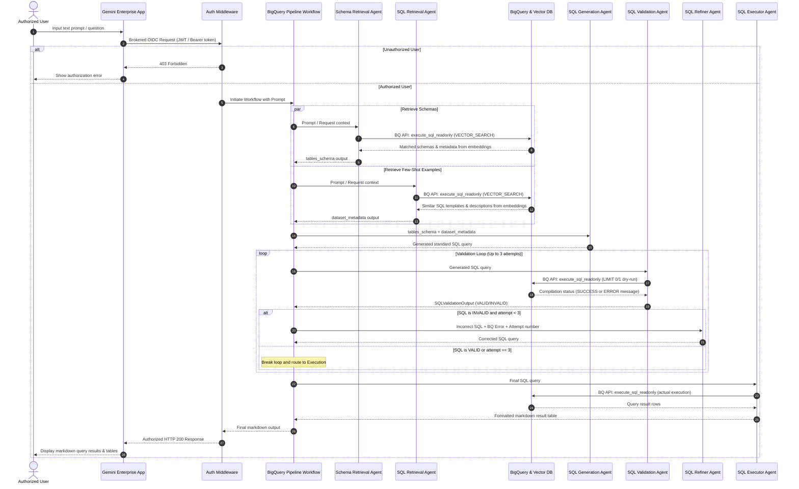

---

## 🤖 Agent System Architecture & Workflows

Our AI agent solution uses the **Google Agent Development Kit (ADK)** to orchestrate multiple sub-agents in a highly secured, parallelized pipeline. Below are the visual maps of how prompts are authorized, how data is retrieved, and how the multi-agent orchestration generates, refines, and executes queries.

### 📊 Agent Workflow Chart

This flowchart details how requests pass through the application-layer security gateway into the parallel retrieval stage, compile validation loop, refinement logic, and final database execution.

### 🔄 Agent Sequence Chart

This sequence diagram illustrates the temporal interactions, parallel processes, back-and-forth validation loops, and security boundaries across the lifetime of a single prompt execution.

### 📖 Step-by-Step Pipeline Execution

The system uses a highly structured, self-correcting multi-agent flow. Here is what happens under the hood during a single user query execution:

#### 1. Ingress & Application-Layer Authentication
* **Trigger**: An authorized user submits a natural-language query to the **Gemini Enterprise App**.
* **Request Route**: The request passes to our Cloud Run container as an HTTP POST request carrying Google-signed OIDC ID tokens.
* **Authentication Middleware**: A custom Starlette `BaseHTTPMiddleware` extracts user emails from identity headers (`X-Goog-Authenticated-User-Email` or through local JWT and Google TokenInfo API decoding).
* **Policy Check**: The email is matched against the `ALLOWED_INVOKERS` environment variable list.
  * *If Unauthorized*: Aborts the request immediately and returns an HTTP `403 Forbidden` response.
  * *If Authorized*: Resolves user identity and forwards the prompt to initiate the `bigquery_pipeline_workflow`.

#### 2. Parallel Context Retrieval
Upon initialization, the workflow launches two parallel branches to retrieve physical and semantic context:
* **Schema Retrieval (`schema_retrieval_agent`)**: Performs a semantic search against the `eikon-dev-ai-team.healthcare_forecasting_jakarta_v2.schema_metadata_embeddings` table using BigQuery's `VECTOR_SEARCH` and regional `get_text_embedding` Remote Function via the `execute_sql_readonly` tool.
* **Semantic SQL Search (`sql_retrieval_agent`)**: Performs a semantic search against the `eikon-dev-ai-team.healthcare_forecasting_jakarta_v2.query_examples_embeddings` table using BigQuery's `VECTOR_SEARCH` and regional `get_text_embedding` Remote Function via the `execute_sql_readonly` tool.

#### 3. Context Merging & SQL Synthesis
* **Joining (`retrieval_join`)**: A specialized `JoinNode` blocks until both parallel retrieval agents complete, gathering their outputs into a single context.
* **Generation (`sql_generation_agent`)**: Fuses the table column structures and matching few-shot examples together. The agent writes a standard BigQuery SQL query matching the exact requirements.

#### 4. Compile-Time Validation & Refinement Loop
Rather than running queries blindly, the system validates the SQL on BigQuery prior to full execution:
* **Dry Run (`sql_validation_agent`)**: Runs a `LIMIT 0` or `LIMIT 1` dry-run check via the BigQuery MCP tool `execute_sql_readonly`. This forces the BigQuery compiler to validate syntax and table structures.
* **Routing Decision (`validation_router`)**:
  * **Success Path**: If the SQL is syntactically correct, the router directs the query to execution (`EXECUTION` route).
  * **Self-Correction Path**: If compilation errors are caught (e.g., column mismatches or missing keywords) and the loop counter is **under 3 attempts**, the router increments the counter and sends the query and compiler logs to the **SQL Refiner Agent** (`REFINEMENT` route).
* **Syntax Refinement (`sql_refiner_agent`)**: Resolves compile-time complaints, updates SQL definitions, and routes the fixed query back to the validation agent for re-compilation.

#### 5. Data Execution & Rendering
* **Execution (`sql_executor_agent`)**: Executes the finalized query against BigQuery.
* **Safety Constraint**: The Executor has strict instructions restricting operations solely to BigQuery read-only calls.
* **Formatting**: Translates raw database rows into a clean, markdown-formatted tables/results representation, which cascades back through the authentication gateway and renders directly in the user's Gemini Enterprise interface.

## Example Prompts & Indexed Questions

The workspace includes a set of 11 curated example prompts (stored in `sql_examples.json` and ingested into the vector database) to teach the SQL agent how to answer queries about the Jakarta healthcare dataset.