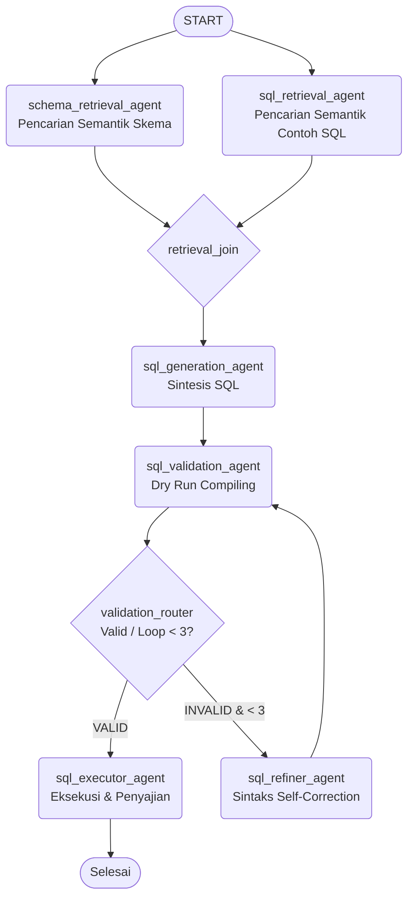
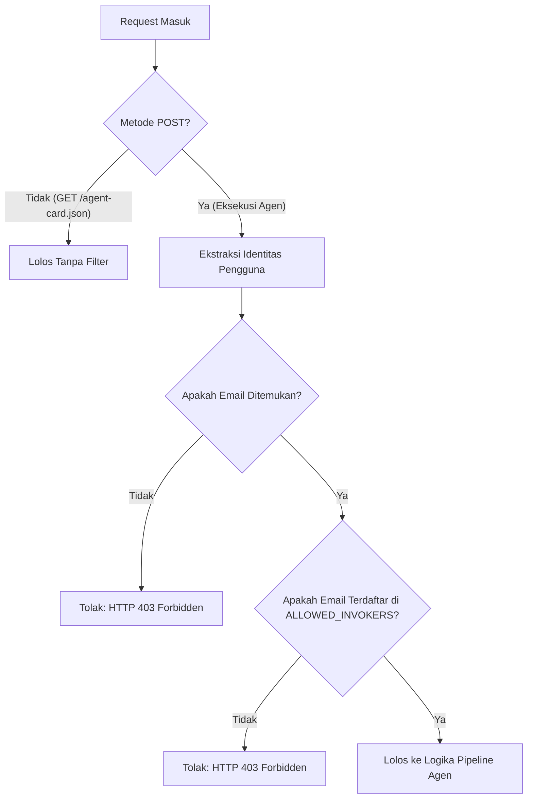

# Membuat bigquery Agent
```
uv add "google-adk[a2a,eval,mcp]"
adk create bigquery_agent
```

```
cd bigquery_agent
```

## agent.py
```python
import os
import logging
from pathlib import Path
from typing import Optional
from fastapi import Request, Response
from fastapi.responses import JSONResponse
from pydantic import BaseModel, Field
from dotenv import load_dotenv

from google.adk.a2a.utils.agent_to_a2a import to_a2a
from google.adk import Workflow, Event, Context
from google.adk.workflow import JoinNode
from google.adk.agents import Agent
from google.adk.models.google_llm import Gemini
from google.adk.tools.mcp_tool import McpToolset, StreamableHTTPConnectionParams

import google.auth
import google.auth.transport.requests
from google.genai import types
from google.genai.models import Models, AsyncModels

# Load environment variables from .env file
env_path = Path(__file__).resolve().parent.parent / ".env"
load_dotenv(dotenv_path=env_path)

# ---------------------------------------------------------
# Dynamic Authentication and Configurations
# ---------------------------------------------------------

# Retry configuration for LLM calls
retry_config = types.HttpRetryOptions(
    attempts=5,  # Maximum retry attempts
    exp_base=7,  # Delay multiplier
    initial_delay=1,  # Initial delay before first retry (in seconds)
    http_status_codes=[429, 500, 503, 504]  # Retry on these HTTP errors
)

def get_bq_access_headers():
    """Dynamically fetch OAuth2 access token for BigQuery API calls."""
    try:
        credentials, project = google.auth.default(
            scopes=["https://www.googleapis.com/auth/cloud-platform"]
        )
        auth_request = google.auth.transport.requests.Request()
        credentials.refresh(auth_request)
        return {"Authorization": f"Bearer {credentials.token}"}
    except Exception as e:
        print(f"Warning: Failed to load Google Application Default Credentials: {e}")
        return {}

bq_access_headers = get_bq_access_headers()

# ---------------------------------------------------------
# Data Schemas (Pydantic Models) for Pipeline Nodes
# ---------------------------------------------------------

class SchemaRetrievalOutput(BaseModel):
    tables_schema: str = Field(description="Summary of the relevant table schemas and columns.")

class SQLRetrievalOutput(BaseModel):
    dataset_metadata: str = Field(description="Summary of the dataset descriptions and metadata.")

class SQLGenerationInput(BaseModel):
    schema_retrieval_agent: SchemaRetrievalOutput
    sql_retrieval_agent: SQLRetrievalOutput

class SQLQuery(BaseModel):
    sql: str = Field(description="The standard BigQuery SQL query.")

class SQLValidationOutput(BaseModel):
    status: str = Field(description="VALID or INVALID status of the query.")
    sql: str = Field(description="The validated SQL query.")
    error: Optional[str] = Field(default=None, description="The compilation error from BigQuery, if INVALID.")

class SQLRefinementInput(BaseModel):
    sql: str = Field(description="The SQL query that failed validation.")
    error: str = Field(description="The compilation or execution error from BigQuery.")
    attempt: int = Field(description="The current validation loop attempt number.")

class SQLExecutionInput(BaseModel):
    sql: str = Field(description="The validated SQL query to execute.")

# ---------------------------------------------------------
# Workflow Nodes Definitions
# ---------------------------------------------------------

# 1. Schema Retrieval Agent
schema_retrieval_agent = Agent(
    model=Gemini(
        model=os.getenv("GEMINI_MODEL", "gemini-3.5-flash"),
        retry_options=retry_config
    ),
    name="schema_retrieval_agent",
    output_schema=SchemaRetrievalOutput,
    instruction=(
        "Anda adalah Schema Retrieval Agent. Tanggung jawab utama Anda adalah mengambil detail skema BigQuery untuk tabel yang relevan dengan permintaan pengguna.\n"
        "Untuk menemukan tabel yang relevan, lakukan pencarian semantik pada tabel `YOUR_PROJECT_ID.healthcare_forecasting_jakarta_v2.schema_metadata_embeddings` menggunakan tool `execute_sql_readonly`.\n"
        "Anda harus menjalankan kueri VECTOR_SEARCH untuk menemukan dokumen skema yang paling relevan. Sebagai contoh:\n"
        "SELECT base.content, distance\n"
        "FROM VECTOR_SEARCH(\n"
        "  TABLE `YOUR_PROJECT_ID.healthcare_forecasting_jakarta_v2.schema_metadata_embeddings`,\n"
        "  'embedding',\n"
        "  query_value => ARRAY(\n"
        "    SELECT LAX_FLOAT64(val) \n"
        "    FROM UNNEST(\n"
        "      JSON_QUERY_ARRAY(\n"
        "        `YOUR_PROJECT_ID.healthcare_forecasting_jakarta_v2.get_text_embedding`('<highly_descriptive_search_query_based_on_user_request>')\n"
        "      )\n"
        "    ) AS val\n"
        "  ),\n"
        "  top_k => 3,\n"
        "  distance_type => 'COSINE'\n"
        ") AS base\n"
        "ORDER BY distance ASC;\n\n"
        "Pastikan `<highly_descriptive_search_query_based_on_user_request>` adalah kueri pencarian deskriptif yang mencerminkan tabel, kolom, atau konsep klinis yang diminta.\n"
        "Berikan ringkasan yang jelas dan mendetail tentang skema, tabel, kolom, dan tipe data yang cocok yang ditemukan pada kolom 'content' dari hasil pencarian ke dalam bidang output 'tables_schema'."
    ),
    tools=[
        McpToolset(
            connection_params=StreamableHTTPConnectionParams(
                url="https://bigquery.googleapis.com/mcp",
                headers=bq_access_headers,
            ),
            tool_filter=["execute_sql_readonly"]
        )
    ],
)

# 2. SQL Retrieval Agent
sql_retrieval_agent = Agent(
    model=Gemini(
        model=os.getenv("GEMINI_MODEL", "gemini-3.5-flash"),
        retry_options=retry_config
    ),
    name="sql_retrieval_agent",
    output_schema=SQLRetrievalOutput,
    instruction=(
        "Anda adalah SQL Retrieval Agent. Tanggung jawab utama Anda adalah mengambil contoh kueri SQL relevan yang telah terindeks sebelumnya untuk memandu proses pembuatan SQL.\n"
        "Untuk menemukan contoh kueri yang relevan, lakukan pencarian semantik pada tabel `YOUR_PROJECT_ID.healthcare_forecasting_jakarta_v2.query_examples_embeddings` menggunakan tool `execute_sql_readonly`.\n"
        "Anda harus menjalankan kueri VECTOR_SEARCH untuk menemukan dokumen contoh SQL yang paling relevan. Sebagai contoh:\n"
        "SELECT base.content, distance\n"
        "FROM VECTOR_SEARCH(\n"
        "  TABLE `YOUR_PROJECT_ID.healthcare_forecasting_jakarta_v2.query_examples_embeddings`,\n"
        "  'embedding',\n"
        "  query_value => ARRAY(\n"
        "    SELECT LAX_FLOAT64(val) \n"
        "    FROM UNNEST(\n"
        "      JSON_QUERY_ARRAY(\n"
        "        `YOUR_PROJECT_ID.healthcare_forecasting_jakarta_v2.get_text_embedding`('<highly_descriptive_search_query_based_on_user_request>')\n"
        "      )\n"
        "    ) AS val\n"
        "  ),\n"
        "  top_k => 5,\n"
        "  distance_type => 'COSINE'\n"
        ") AS base\n"
        "ORDER BY distance ASC;\n\n"
        "Pastikan `<highly_descriptive_search_query_based_on_user_request>` adalah kueri pencarian deskriptif yang mencerminkan permintaan data pengguna.\n"
        "Berikan daftar contoh SQL yang jelas dan mendetail serta deskripsinya yang ditemukan pada kolom 'content' dari hasil pencarian ke dalam bidang output 'dataset_metadata' agar SQL Generation Agent dapat mereplikasi strukturnya."
    ),
    tools=[
        McpToolset(
            connection_params=StreamableHTTPConnectionParams(
                url="https://bigquery.googleapis.com/mcp",
                headers=bq_access_headers,
            ),
            tool_filter=["execute_sql_readonly"]
        )
    ],
)

# 3. Retrieval Stage Parallel Join Node
retrieval_join = JoinNode(name="retrieval_join")

# 4. SQL Generation Agent
sql_generation_agent = Agent(
    model=Gemini(
        model=os.getenv("GEMINI_MODEL", "gemini-3.5-flash"),
        retry_options=retry_config
    ),
    name="sql_generation_agent",
    input_schema=SQLGenerationInput,
    output_schema=SQLQuery,
    instruction=(
        "Anda adalah SQL Generation Agent.\n"
        "Tugas Anda adalah menghasilkan kueri SQL BigQuery standar yang valid untuk menjawab permintaan pengguna berdasarkan skema dan metadata yang disediakan di bawah ini.\n\n"
        "Informasi Skema:\n"
        "{SQLGenerationInput.schema_retrieval_agent.tables_schema}\n\n"
        "Metadata Dataset:\n"
        "{SQLGenerationInput.sql_retrieval_agent.dataset_metadata}\n\n"
        "Pastikan kueri yang dihasilkan adalah SQL standar dan berhasil dieksekusi.\n"
        "Keluarkan HANYA kueri SQL di dalam kolom output 'sql' pada skema."
    ),
)

# 5. SQL Validation Agent
sql_validation_agent = Agent(
    model=Gemini(
        model=os.getenv("GEMINI_MODEL", "gemini-3.5-flash"),
        retry_options=retry_config
    ),
    name="sql_validation_agent",
    input_schema=SQLQuery,
    output_schema=SQLValidationOutput,
    instruction=(
        "Anda adalah SQL Validation Agent. Tugas Anda adalah memvalidasi apakah kueri SQL yang diberikan sudah benar, valid secara sintaksis, dan sesuai dengan skema yang diambil.\n"
        "Kueri SQL yang akan divalidasi adalah:\n"
        "{SQLQuery.sql}\n\n"
        "Untuk memvalidasi kueri tersebut, eksekusi kueri dengan tambahan `LIMIT 1` atau `LIMIT 0` menggunakan tool `execute_sql_readonly`. Hal ini memastikan BigQuery mengompilasi dan memverifikasinya tanpa memproses volume data yang besar.\n"
        "Jika eksekusi berhasil, isi kolom output sebagai:\n"
        "- status: 'VALID'\n"
        "- sql: '<the_sql_query>'\n"
        "- error: None\n\n"
        "Jika eksekusi gagal, isi kolom output sebagai:\n"
        "- status: 'INVALID'\n"
        "- sql: '<the_sql_query>'\n"
        "- error: '<pesan kesalahan kompilasi eksak dari BigQuery>'"
    ),
    tools=[
        McpToolset(
            connection_params=StreamableHTTPConnectionParams(
                url="https://bigquery.googleapis.com/mcp",
                headers=bq_access_headers,
            ),
            tool_filter=["execute_sql_readonly"]
        )
    ],
)

# 6. SQL Validation Router Node (Issues Found Decision & Max 3 Iteration Counter)
def validation_router(ctx: Context, node_input: SQLValidationOutput) -> Event:
    """Routes the workflow based on validation results and limits the loop to 3 iterations."""
    current_count = ctx.state.get("validation_loop_count", 0)
    
    if node_input.status.upper() == "VALID":
        ctx.state["validation_loop_count"] = 0
        return Event(route="EXECUTION", output=SQLExecutionInput(sql=node_input.sql))
    
    if current_count < 3:
        ctx.state["validation_loop_count"] = current_count + 1
        print(f"[Validation Router] Validation failed (Attempt {current_count + 1}/3). Error: {node_input.error}. Routing to Refiner...")
        return Event(
            route="REFINEMENT",
            output=SQLRefinementInput(
                sql=node_input.sql,
                error=node_input.error or "Unknown BigQuery compilation error.",
                attempt=current_count + 1
            )
        )
    else:
        print("[Validation Router] Max validation attempts reached. Proceeding to execution with best-effort SQL...")
        ctx.state["validation_loop_count"] = 0
        return Event(route="EXECUTION", output=SQLExecutionInput(sql=node_input.sql))

# 7. SQL Refiner Agent
sql_refiner_agent = Agent(
    model=Gemini(
        model=os.getenv("GEMINI_MODEL", "gemini-3.5-flash"),
        retry_options=retry_config
    ),
    name="sql_refiner_agent",
    input_schema=SQLRefinementInput,
    output_schema=SQLQuery,
    instruction=(
        "Anda adalah SQL Refiner Agent. Tugas Anda adalah memperbaiki kueri SQL yang gagal dalam proses validasi.\n"
        "Berikut adalah kueri SQL yang salah:\n"
        "{SQLRefinementInput.sql}\n\n"
        "Berikut adalah kesalahan kompilasi atau waktu jalan eksak dari BigQuery:\n"
        "{SQLRefinementInput.error}\n\n"
        "Ini adalah percobaan ke-{SQLRefinementInput.attempt} dari 3.\n\n"
        "Analisis SQL dan kesalahan tersebut secara cermat. Perbaiki sintaksis, referensi tabel, nama kolom, atau join sesuai petunjuk dari pesan kesalahan.\n"
        "Keluarkan HANYA kueri SQL hasil perbaikan di dalam kolom output 'sql' pada skema."
    ),
)

# 8. SQL Executor Agent
sql_executor_agent = Agent(
    model=Gemini(
        model=os.getenv("GEMINI_MODEL", "gemini-3.5-flash"),
        retry_options=retry_config
    ),
    name="sql_executor_agent",
    input_schema=SQLExecutionInput,
    instruction=(
        "Anda adalah SQL Executor Agent. Tugas Anda adalah mengeksekusi kueri SQL final yang telah divalidasi dan menyajikan hasilnya.\n"
        "Berikut adalah kueri SQL tervalidasi yang akan dijalankan:\n"
        "{SQLExecutionInput.sql}\n\n"
        "Gunakan tool `execute_sql_readonly` untuk mengeksekusi kueri ini di BigQuery.\n"
        "Format hasil kueri akhir ke dalam tabel markdown yang bersih, profesional, dan menarik secara visual.\n"
        "BATASAN KETAT: Anda HANYA boleh menangani operasi BigQuery dan pelaporan hasil kueri. "
        "Anda sama sekali tidak diperbolehkan melakukan operasi atau integrasi di luar cakupan database BigQuery. Cukup sajikan wawasan data yang diminta."
    ),
    tools=[
        McpToolset(
            connection_params=StreamableHTTPConnectionParams(
                url="https://bigquery.googleapis.com/mcp",
                headers=bq_access_headers,
            ),
            tool_filter=["execute_sql_readonly"]
        )
    ],
)

# Nested BigQuery Orchestration Workflow Node
bigquery_workflow = Workflow(
    name="bigquery_pipeline_workflow",
    edges=[
        ("START", schema_retrieval_agent),
        ("START", sql_retrieval_agent),
        (schema_retrieval_agent, retrieval_join),
        (sql_retrieval_agent, retrieval_join),
        (retrieval_join, sql_generation_agent),
        (sql_generation_agent, sql_validation_agent),
        (sql_validation_agent, validation_router),
        (validation_router, {
            "REFINEMENT": sql_refiner_agent,
            "EXECUTION": sql_executor_agent
        }),
        (sql_refiner_agent, sql_validation_agent),
    ]
)

# Patch sub_agents attribute for BigQuery workflow to satisfy ADK AgentCardBuilder
object.__setattr__(bigquery_workflow, 'sub_agents', [
    schema_retrieval_agent,
    sql_retrieval_agent,
    sql_generation_agent,
    sql_validation_agent,
    sql_refiner_agent,
    sql_executor_agent
])

# Export as root_agent for the ADK loading entrypoint
root_agent = bigquery_workflow
```

---

## 📘 Penjelasan Arsitektur & Logika Kode (`agent.py`)

Skrip `agent.py` di atas mengimplementasikan sistem orkestrasi multi-agen cerdas untuk berinteraksi dengan database Google BigQuery. Dengan memanfaatkan **Google Agent Development Kit (ADK)**, sistem ini memecah tugas kompleks pembuatan dan eksekusi SQL menjadi serangkaian langkah terisolasi yang dijalankan oleh agen-agen spesialis secara paralel dan kolaboratif.

Berikut adalah penjelasan mendalam mengenai komponen-mana komponen utama dalam skrip ini:

### 1. Autentikasi Dinamis & Konfigurasi Google Cloud
* **`get_bq_access_headers()`**: Fungsi ini secara dinamis mengambil kredensial autentikasi default Google Cloud (`google.auth.default`) dengan cakupan (*scope*) penuh untuk platform cloud. Token OAuth2 diambil dan di-refresh secara berkala, lalu disisipkan ke dalam header otorisasi HTTP untuk mengamankan panggilan API Model Context Protocol (MCP) BigQuery.
* **`retry_config`**: Mengonfigurasi mekanisme *retry* eksponensial (hingga 5 kali percobaan) untuk panggilan model LLM Vertex AI guna mengantisipasi kendala jaringan, batasan kuota (*rate limiting* / HTTP 429), atau gangguan server (HTTP 5xx).

---

### 2. Agen Spesialis di Dalam Pipeline

Sistem ini membagi tugas ke dalam 6 agen dengan tanggung jawab terisolasi (*separation of concerns*):

#### A. Schema Retrieval Agent (`schema_retrieval_agent`)
* **Tanggung Jawab**: Menemukan struktur skema tabel fisik, deskripsi kolom, serta tipe data yang relevan dengan pertanyaan pengguna.
* **Metode Kerja**: Menjalankan kueri pencarian semantik `VECTOR_SEARCH` secara langsung pada tabel `schema_metadata_embeddings` di dataset BigQuery. Proses ini mengubah kata kunci masukan menjadi vektor embedding regional melalui Remote Function `get_text_embedding` guna menemukan skema tabel terdekat yang paling cocok (pencarian berbasis makna logis, bukan sekadar kecocokan kata kunci).

#### B. SQL Retrieval Agent (`sql_retrieval_agent`)
* **Tanggung Jawab**: Mengambil contoh-contoh kueri SQL cerdas beserta deskripsi pertanyaan pasangan (*few-shot examples*) yang telah terindeks sebelumnya.
* **Metode Kerja**: Melakukan hal serupa menggunakan `VECTOR_SEARCH` di BigQuery pada tabel `query_examples_embeddings` untuk mencari pola kueri historis yang memiliki kemiripan semantik tinggi dengan kebutuhan saat ini. Contoh kueri ini berguna sebagai panduan bentuk (*few-shot*) bagi agen pembuat SQL berikutnya.

#### C. SQL Generation Agent (`sql_generation_agent`)
* **Tanggung Jawab**: Menyintesis kueri SQL BigQuery standar yang valid.
* **Metode Kerja**: Agen ini menerima gabungan informasi dari `schema_retrieval_agent` (untuk kolom fisik) dan `sql_retrieval_agent` (untuk pola kueri historis). Berdasarkan konteks terpadu tersebut, LLM menulis satu kueri SQL standar.

#### D. SQL Validation Agent (`sql_validation_agent`)
* **Tanggung Jawab**: Memastikan bahwa SQL yang dihasilkan bebas dari kesalahan sintaksis atau struktur skema sebelum benar-benar dieksekusi ke database.
* **Metode Kerja**: Mengeksekusi kueri yang dibuat dengan tambahan klausa `LIMIT 0` atau `LIMIT 1` melalui tool `execute_sql_readonly`. Langkah pengujian ini memaksa kompiler BigQuery memverifikasi kebenaran kueri tanpa memproses atau menarik volume data yang besar (sangat efisien biaya dan aman).

#### E. SQL Refiner Agent (`sql_refiner_agent`)
* **Tanggung Jawab**: Memperbaiki kueri SQL jika validasi sebelumnya gagal.
* **Metode Kerja**: Mengambil kueri SQL yang salah beserta *error log* lengkap langsung dari kompiler BigQuery. Agen ini menganalisis letak kesalahan, memperbaiki sintaks/join/kolom, dan mengirimkan kembali kueri hasil perbaikan ke proses validasi.

#### F. SQL Executor Agent (`sql_executor_agent`)
* **Tanggung Jawab**: Mengeksekusi kueri SQL final yang sudah divalidasi dan menyajikan data kepada pengguna.
* **Metode Kerja**: Melakukan eksekusi data riil menggunakan tool `execute_sql_readonly`, menyusun data tabel mentah dari BigQuery, dan memformat hasilnya ke dalam bentuk tabel Markdown yang rapi, profesional, dan mudah dibaca.
* > [!IMPORTANT]
  > Memiliki batasan ketat (*strict constraint*) yang melarang segala bentuk pembuatan aksi eksternal non-BigQuery untuk menjaga keamanan sistem.

---

### 3. Logika Aliran Kerja & Kontrol Router

Aliran logika antar agen diatur secara ketat melalui fungsionalitas deklaratif ADK:

1. **Penggabungan Paralel (`retrieval_join`)**:
   Objek `JoinNode` bertindak sebagai gerbang sinkronisasi. Langkah ini memastikan bahwa `sql_generation_agent` baru akan mulai bekerja **setelah** kedua pencarian paralel (`schema_retrieval_agent` dan `sql_retrieval_agent`) selesai mengumpulkan data.
   
2. **Perulangan Perbaikan Mandiri (`validation_router`)**:
   Fungsi router ini bertindak sebagai pengambil keputusan cerdas di dalam workflow:
   * Jika status pengujian adalah `VALID`, kueri langsung dialirkan ke rute `EXECUTION` (`sql_executor_agent`).
   * Jika berstatus `INVALID` dan jumlah iterasi perbaikan masih di bawah batas maksimum (maksimal 3 kali percobaan), alur diarahkan ke rute `REFINEMENT` (`sql_refiner_agent`).
   * Jika batas maksimal 3 kali percobaan tercapai namun kueri masih error, alur tetap diarahkan ke `EXECUTION` untuk menyajikan hasil terbaik demi menghindari perulangan tanpa akhir (*infinite loop*).


---
## A2A Protocol

Protokol **Agent-to-Agent (A2A)** adalah standar komunikasi terstruktur yang memungkinkan agen-agen AI independen saling berinteraksi, bertukar kapabilitas, dan berkolaborasi layaknya API web standar. 

Dalam implementasi kita:
* **Fungsi `to_a2a`**: Mengonversi alur kerja orkestrasi grafis `bigquery_workflow` (berbasis ADK) menjadi aplikasi web FastAPI siap pakai. Fungsi ini secara otomatis membuat rute API standar untuk interaksi dan eksekusi agen.
* **Agent Card (`agent-card.json`)**: Merupakan dokumen manifestasi semantik (metadata kartu agen). Kartu ini mendeskripsikan secara lengkap nama agen, versi protokol, kapabilitas, serta deskripsi detail dari sub-agen dan alat (*tools*) yang dimiliki. Manifest ini digunakan oleh platform perantara (*broker*) atau agen lain untuk memahami cara berinteraksi dengan sistem kita secara otomatis tanpa perlu membaca kode sumbernya.

> [!NOTE]
> Dengan mengekspos endpoint `.well-known/agent-card.json`, Gemini Enterprise dapat melakukan inspeksi otomatis (*introspection*) untuk mendaftarkan dan memetakan kapabilitas pencarian database kita.

- Buka `agent.py` dan tambahkan kode berikut:

```python
from google.adk.a2a.utils.agent_to_a2a import to_a2a
...
# Patch sub_agents attribute for all workflows to satisfy ADK AgentCardBuilder
object.__setattr__(root_agent, 'sub_agents', [
    bigquery_workflow
])

# Patch sub_agents attribute for BigQuery workflow to satisfy ADK AgentCardBuilder
object.__setattr__(bigquery_workflow, 'sub_agents', [
    schema_retrieval_agent,
    sql_retrieval_agent,
    sql_generation_agent,
    sql_validation_agent,
    sql_refiner_agent,
    sql_executor_agent
])

current_dir = os.path.dirname(os.path.abspath(__file__))

app_port = int(os.environ.get("PORT", 10001))

a2a_app = to_a2a(
                root_agent, 
                port=app_port,
                 )
```
- Di terminal anda jalankan:

```bash
uv run uvicorn bigquery_agent.agent:a2a_app --port 10001
```

- kemudian buka terminal baru dan jalankan:
```bash
curl http://127.0.0.1:10001/.well-known/agent-card.json
```

Buat file agent-card.json
```bash
touch bigquery_agent/agent-card.json
```

- Buka [json formatter](https://jsonformatter.org/)

- copy paste agent-card ke json formatter
- Kemudian paste hasil yang sudah rapi ke `agent-card.json` anda

- edit `agent.py` tambahkan line berikut

```python

agent_card_path = os.path.join(current_dir, 'agent-card.json')

a2a_app = to_a2a(
                root_agent, 
                port=app_port,
                agent_card=agent_card_path,
                 )
```

## Middleware
**Middleware** adalah komponen perangkat lunak penengah yang berada di antara jaringan masuk (*incoming request*) dan logika inti aplikasi (*endpoint handler*). Middleware memeriksa, memodifikasi, atau memfilter setiap permintaan HTTP yang masuk sebelum permintaan tersebut diproses oleh agen.

#### Cara Kerja `AuthorizationMiddleware`
Middleware otorisasi dalam sistem kita dirancang khusus untuk mengamankan endpoint dari akses ilegal dengan alur logika sebagai berikut:



1. **Pemeriksaan Metode**: Permintaan bertipe `GET` (seperti melihat kartu agen) dilewatkan tanpa hambatan agar sistem luar dapat mengenali kapabilitas agen. Namun, permintaan bertipe `POST` (eksekusi pipeline/pencarian data) wajib melewati validasi identitas yang ketat.
2. **Ekstraksi Email Pengguna (Multi-Metode)**:
   * **Header Google Cloud**: Membaca header `x-goog-authenticated-user-email` atau sejenisnya yang diteruskan secara otomatis oleh Google Cloud Identity-Aware Proxy (IAP) atau Gemini Enterprise broker.
   * **Dekode JWT Lokal**: Jika autentikasi menggunakan Bearer JWT token (`eyJ...`), middleware secara aman melakukan dekode payload JWT di tingkat lokal untuk mengekstrak klaim `"email"`.
   * **Google TokenInfo API (Fallback)**: Jika token berupa Google Access Token biasa, middleware memvalidasinya langsung ke endpoint resmi `oauth2.googleapis.com/tokeninfo` untuk mencocokkan email pemilik token.
3. **Pencocokan ALLOWED_INVOKERS**: Email yang berhasil diekstrak dicocokkan dengan daftar email terotorisasi yang didefinisikan dalam variabel lingkungan `ALLOWED_INVOKERS` di file `.env`.
   * Jika cocok, request diizinkan masuk ke pipeline BigQuery.
   * Jika tidak cocok atau tidak terotentikasi, middleware langsung mengembalikan respon penolakan **`HTTP 403 Forbidden`** dengan pesan penjelasan yang aman.

> [!IMPORTANT]
> Middleware ini memberikan perlindungan berlapis di tingkat aplikasi (Zero-Trust Architecture) untuk mencegah eksekusi kueri BigQuery yang tidak sah dan menjaga kerahasiaan data medis/klinis yang sensitif.
---

- Buka `agent.py` dan tambahkan code berikut:
```python
...

# ---------------------------------------------------------
# Application-Layer User Authorization Middleware
# ---------------------------------------------------------
from fastapi import Request
from starlette.middleware.base import BaseHTTPMiddleware
from starlette.responses import JSONResponse

logger = logging.getLogger("uvicorn.error")

class AuthorizationMiddleware(BaseHTTPMiddleware):
    async def dispatch(self, request: Request, call_next):
        method = request.method
        path = request.url.path
        headers = dict(request.headers)
        
        # Extract email from Google user authentication headers
        user_email = None
        for key, val in headers.items():
            if key.lower() in ["x-goog-authenticated-user-email", "x-goog-user-email", "x-authenticated-user-email"]:
                # Standard header prefix is 'accounts.google.com:email'
                if ":" in val:
                    user_email = val.split(":")[-1].strip()
                else:
                    user_email = val.strip()
                break

        # Fallback: Extract from standard Authorization header (Google token from Gemini Enterprise broker)
        if not user_email:
            for key, val in headers.items():
                if key.lower() == "authorization":
                    if val.lower().startswith("bearer "):
                        token = val.split(" ", 1)[1].strip()
                        
                        # Log token details for diagnostics (length and prefix, NO sensitive signatures)
                        token_len = len(token)
                        token_prefix = token[:10] if token_len >= 10 else token
                        logger.info(f"[Auth Middleware] Diagnosing Authorization token: len={token_len}, prefix='{token_prefix}'")
                        
                        # Attempt 1: Local JWT decoding (only if it's actually a JWT starting with eyJ)
                        if token.startswith("eyJ"):
                            try:
                                parts = token.split(".")
                                if len(parts) == 3:
                                    payload = parts[1]
                                    payload += "=" * ((4 - len(payload) % 4) % 4)
                                    import base64
                                    import json
                                    decoded = base64.urlsafe_b64decode(payload.encode("utf-8")).decode("utf-8")
                                    payload_dict = json.loads(decoded)
                                    user_email = payload_dict.get("email")
                                    if user_email:
                                        logger.info(f"[Auth Middleware] Extracted email from local JWT: {user_email}")
                            except Exception as e:
                                logger.error(f"[Auth Middleware] Local JWT decode failed: {e}")
                        
                        # Attempt 2: Google TokenInfo API (fallback for OAuth Access Tokens or other Google tokens)
                        if not user_email:
                            import urllib.request
                            import urllib.parse
                            import json
                            
                            # Try as access token first
                            try:
                                url = f"https://oauth2.googleapis.com/tokeninfo?access_token={urllib.parse.quote(token)}"
                                req = urllib.request.Request(url, method="GET")
                                with urllib.request.urlopen(req, timeout=5) as response:
                                    data = json.loads(response.read().decode("utf-8"))
                                    user_email = data.get("email")
                                    if user_email:
                                        logger.info(f"[Auth Middleware] Extracted email from TokenInfo (access_token): {user_email}")
                            except Exception as e:
                                logger.debug(f"[Auth Middleware] TokenInfo as access_token failed: {e}")
                                
                            # Try as ID token fallback
                            if not user_email:
                                try:
                                    url = f"https://oauth2.googleapis.com/tokeninfo?id_token={urllib.parse.quote(token)}"
                                    req = urllib.request.Request(url, method="GET")
                                    with urllib.request.urlopen(req, timeout=5) as response:
                                        data = json.loads(response.read().decode("utf-8"))
                                        user_email = data.get("email")
                                        if user_email:
                                            logger.info(f"[Auth Middleware] Extracted email from TokenInfo (id_token): {user_email}")
                                except Exception as e:
                                    logger.debug(f"[Auth Middleware] TokenInfo as id_token failed: {e}")
                    break

        # Sanitize headers to protect secrets/tokens while printing everything else
        sanitized_headers = {
            k: ("[REDACTED]" if k.lower() in ("authorization", "cookie", "x-goog-api-key") else v)
            for k, v in headers.items()
        }
        
        logger.info(f"[Auth Middleware] Incoming Request: {method} {path}")
        logger.info(f"[Auth Middleware] Sanitized Headers: {sanitized_headers}")
        logger.info(f"[Auth Middleware] Extracted User Email: {user_email}")
        
        # Enforce authorization for all POST requests (actual agent execution calls)
        if method == "POST":
            # Retrieve allowed invokers list dynamically from environment variables
            allowed_invokers_env = os.environ.get("ALLOWED_INVOKERS")
            
            # Clean up potential surrounding square brackets [] if passed as a string list representation
            cleaned_env = allowed_invokers_env.strip().lstrip("[").rstrip("]")
            
            allowed_users = set()
            for invoker in cleaned_env.split(","):
                # Strip leading/trailing spaces and potential quotes (' or ")
                invoker = invoker.strip().strip("'").strip('"')
                if invoker.startswith("user:"):
                    allowed_users.add(invoker.replace("user:", "").strip().lower())
            
            if not user_email:
                logger.error("[Auth Middleware] Denied: Missing user email authentication header.")
                return JSONResponse(
                    status_code=403,
                    content={"detail": "Forbidden: Request is missing user authentication headers."}
                )
                
            if user_email.lower() not in allowed_users:
                logger.error(f"[Auth Middleware] Denied: User '{user_email}' is not authorized.")
                return JSONResponse(
                    status_code=403,
                    content={"detail": f"Forbidden: User '{user_email}' is not authorized."}
                )
                
            logger.info(f"[Auth Middleware] Allowed: User '{user_email}' is authorized.")

        response = await call_next(request)
        return response

a2a_app.add_middleware(AuthorizationMiddleware)
```

- Edit `agent-card.json` dan tambahkan line berikut:
```json
  "security": [
    {
      "google_oauth": [
        "openid",
        "email",
        "profile"
      ]
    }
  ],
  "securitySchemes": {
    "google_oauth": {
      "type": "oauth2",
      "description": "Google Authentication",
      "flows": {
        "authorizationCode": {
           "authorizationUrl": "https://accounts.google.com/o/oauth2/auth?access_type=offline&prompt=consent",
          "tokenUrl": "https://oauth2.googleapis.com/token",
          "scopes": {
            "openid": "Authenticate using your Google account",
            "email": "View your email address",
            "profile": "View basic profile information"
          }
        }
      }
    }
  },
```
---

## 🛡️ Penjelasan Mendalam: A2A & Middleware

Seksi ini menjelaskan secara mendalam konsep **Agent-to-Agent (A2A)** dan **Middleware Otorisasi** yang diintegrasikan ke dalam `agent.py`.

### 1. Apa itu A2A (Agent-to-Agent)?

Protokol **Agent-to-Agent (A2A)** adalah standar komunikasi terstruktur yang memungkinkan agen-agen AI independen saling berinteraksi, bertukar kapabilitas, dan berkolaborasi layaknya API web standar. 

Dalam implementasi kita:
* **Fungsi `to_a2a`**: Mengonversi alur kerja orkestrasi grafis `bigquery_workflow` (berbasis ADK) menjadi aplikasi web FastAPI siap pakai. Fungsi ini secara otomatis membuat rute API standar untuk interaksi dan eksekusi agen.
* **Agent Card (`agent-card.json`)**: Merupakan dokumen manifestasi semantik (metadata kartu agen). Kartu ini mendeskripsikan secara lengkap nama agen, versi protokol, kapabilitas, serta deskripsi detail dari sub-agen dan alat (*tools*) yang dimiliki. Manifest ini digunakan oleh platform perantara (*broker*) atau agen lain untuk memahami cara berinteraksi dengan sistem kita secara otomatis tanpa perlu membaca kode sumbernya.

> [!NOTE]
> Dengan mengekspos endpoint `.well-known/agent-card.json`, broker eksternal (seperti Gemini Enterprise Broker) dapat melakukan inspeksi otomatis (*introspection*) untuk mendaftarkan dan memetakan kapabilitas pencarian database kita.

---
##  Panduan Deployment ke Google Cloud Run (Region Jakarta)

Google Cloud Run adalah layanan komputasi tanpa server (*fully managed serverless*) yang sangat cocok untuk menjalankan kontainer agen A2A kita karena mendukung autoscaling otomatis, HTTPS bawaan, dan integrasi erat dengan IAM Google Cloud.

Berikut adalah langkah-langkah untuk mendeploy `bigquery_agent` ke region **Jakarta (`asia-southeast2`)**:

### Prasyarat
1. **Google Cloud SDK (`gcloud`)** sudah terinstal dan terkonfigurasi pada mesin Anda.
2. Akun Google Cloud memiliki peran minimal **Cloud Run Developer**, **Service Account User**, dan **Artifact Registry Administrator**.
3. Pastikan API berikut telah diaktifkan pada proyek Google Cloud Anda:
   ```bash
   gcloud services enable run.googleapis.com \
                          artifactregistry.googleapis.com \
                          cloudbuild.googleapis.com
   ```

---

### Langkah 1: Siapkan Dockerfile
Buat sebuah file bernama `Dockerfile` di direktori utama project dengan isi sebagai berikut:

```dockerfile
# Use an official Python runtime as a parent image
FROM python:3.14-slim

# Install uv directly from the official Astral image
COPY --from=ghcr.io/astral-sh/uv:latest /uv /uvx /bin/

# Set the working directory
WORKDIR /app

# Enable bytecode compilation for faster app startup
ENV UV_COMPILE_BYTECODE=1

# Copy dependency files first to leverage Docker layer caching
COPY pyproject.toml uv.lock ./

# Install dependencies into a virtual environment (.venv)
RUN uv sync --frozen --no-install-project --no-dev

# Copy the rest of the application code
COPY . .

# Sync the project itself (installs the local package if defined in pyproject.toml)
RUN uv sync --frozen --no-dev

# Place the uv virtual environment executables in the PATH
# This allows you to run 'uvicorn' directly without prefixing it with 'uv run'
ENV PATH="/app/.venv/bin:$PATH"

# We will define the startup command in docker-compose
CMD uv run uvicorn bigquery_agent.agent:a2a_app --host 0.0.0.0 --port $PORT
```

---

### Langkah 2: Deploy ke Cloud Run menggunakan Google Cloud Build
Gunakan perintah `gcloud run deploy` dari direktori utama proyek untuk membangun kontainer secara otomatis di cloud dan menyebarkannya ke region Jakarta (`asia-southeast2`):

```bash
gcloud run deploy a2a-bigqueryml-agent \
    --source . \
    --region asia-southeast2 \
    --set-env-vars="GOOGLE_GENAI_USE_VERTEXAI=1,GOOGLE_CLOUD_PROJECT=YOUR_PROJECT_ID,GOOGLE_CLOUD_LOCATION=global,GEMINI_MODEL=gemini-3.5-flash,ALLOWED_INVOKERS=user:user1@email.com" \
    --allow-unauthenticated
```

> [!TIP]
> Parameter `--source .` menginstruksikan Cloud Run untuk mengunggah kode sumber lokal Anda ke Google Cloud Build, membangun kontainer menggunakan Dockerfile di atas secara aman, lalu menyimpannya di Artifact Registry sebelum dideploy.

---

### Langkah 3: Konfigurasi Keamanan & Service Account (Sangat Penting)
Secara default, kontainer Cloud Run berjalan menggunakan Default Compute Service Account. Agar agen Anda dapat melakukan kueri ke Google BigQuery, Service Account tersebut harus diberikan izin akses yang memadai.

1. **Dapatkan nama Service Account** yang digunakan oleh layanan Cloud Run Anda:
   ```bash
   # Ganti PROJECT_ID dengan ID proyek Google Cloud Anda
   # Default Service Account biasanya berformat: [PROJECT_NUMBER]-compute@developer.gserviceaccount.com
   ```

2. **Berikan Peran IAM BigQuery**:
   Jalankan perintah berikut untuk memberikan peran **BigQuery Admin** atau **BigQuery User** + **BigQuery Data Viewer** agar agen dapat menjalankan query `execute_sql_readonly`:
   ```bash
   # Memberikan akses eksekusi BigQuery
   gcloud projects add-iam-policy-binding YOUR_PROJECT_ID \
     --member="serviceAccount:PROJECT_NUMBER-compute@developer.gserviceaccount.com" \
     --role="roles/bigquery.admin"
   ```

---

### Langkah 4: Verifikasi Hasil Deployment
- Ubah url di `agent-card.json` yang semula `localhost` menjadi:
```json
{
    ...
    "url": "https://bigquery-agent-xxxx-et.a.run.app/.well-known/agent-card.json"
}
```
- Kemudian deploy ulang

- Setelah deployment selesai, Cloud Run akan menampilkan URL HTTPS publik untuk layanan Anda, misalnya:
`https://bigquery-agent-xxxx-et.a.run.app`

- Anda dapat menguji bahwa agen Anda telah berjalan sukses di Jakarta dengan memanggil agent-card.json nya:
```bash
curl https://bigquery-agent-xxxx-et.a.run.app/.well-known/agent-card.json
```

- Kemudian COPY hasilnya paste di JSON formatter, hasil JSON yang sudah di format di copy

## Gemini Enterprise
- Buka gemini enterprise kemudian buat aplikasi baru
- Pilih `Agents`, pilih `+ Add agent`, pilih `Custom agent via A2A`
- Paste hasil `agent-card.json` sebelumnya, kemudian klik `Preview Agent Details`
- klik `Next`
- Buka tab baru, `APIs & Services ⟶ Oauth consent screen ⟶ Clients`
- Copy dan Paste: `Client ID`  beserta `Client secret`, klik `Finish`
- Coba query dengan agent yang baru dibuat
- Apabila muncul tulisan seperti dibawah klik `Authorize`
```
The agent requires additional authorization for:
```

> [!IMPORTANT]
- Apabila muncul error: 
```
ValueError: part_metadata parameter is only supported in Gemini Developer API mode, not in Gemini Enterprise Agent Platform mode.
```

- update `agent.py` dengan script berikut: 
```python
from google.genai.models import Models, AsyncModels

# ---------------------------------------------------------
# Monkey-patch to fix Google GenAI SDK part_metadata issue
# ---------------------------------------------------------
def _strip_part_metadata(obj):
    """Recursively strip part_metadata from any Part object or dictionary to prevent ValueError in Vertex AI mode."""
    if obj is None:
        return
    if hasattr(obj, "part_metadata"):
        try:
            obj.part_metadata = None
        except Exception:
            pass
    if isinstance(obj, (list, tuple)):
        for item in obj:
            _strip_part_metadata(item)
    if hasattr(obj, "parts"):
        _strip_part_metadata(getattr(obj, "parts"))
    if isinstance(obj, dict):
        if "part_metadata" in obj:
            obj["part_metadata"] = None
        for key, val in obj.items():
            _strip_part_metadata(val)

# Save original methods
_orig_sync_gen = Models.generate_content
_orig_sync_gen_stream = Models.generate_content_stream
_orig_async_gen = AsyncModels.generate_content
_orig_async_gen_stream = AsyncModels.generate_content_stream

def patched_sync_gen(self, *args, **kwargs):
    if "contents" in kwargs:
        _strip_part_metadata(kwargs["contents"])
    elif len(args) > 1:
        args_list = list(args)
        _strip_part_metadata(args_list[1])
        args = tuple(args_list)
    return _orig_sync_gen(self, *args, **kwargs)

def patched_sync_gen_stream(self, *args, **kwargs):
    if "contents" in kwargs:
        _strip_part_metadata(kwargs["contents"])
    elif len(args) > 1:
        args_list = list(args)
        _strip_part_metadata(args_list[1])
        args = tuple(args_list)
    return _orig_sync_gen_stream(self, *args, **kwargs)

async def patched_async_gen(self, *args, **kwargs):
    if "contents" in kwargs:
        _strip_part_metadata(kwargs["contents"])
    elif len(args) > 1:
        args_list = list(args)
        _strip_part_metadata(args_list[1])
        args = tuple(args_list)
    return await _orig_async_gen(self, *args, **kwargs)

async def patched_async_gen_stream(self, *args, **kwargs):
    if "contents" in kwargs:
        _strip_part_metadata(kwargs["contents"])
    elif len(args) > 1:
        args_list = list(args)
        _strip_part_metadata(args_list[1])
        args = tuple(args_list)
    return await _orig_async_gen_stream(self, *args, **kwargs)

# Apply patches
Models.generate_content = patched_sync_gen
Models.generate_content_stream = patched_sync_gen_stream
AsyncModels.generate_content = patched_async_gen
AsyncModels.generate_content_stream = patched_async_gen_stream
```

Berikut adalah penjelasan mendalam mengenai skrip Python Monkey-patch yang digunakan untuk mengatasi masalah  `part_metadata`  pada Google GenAI SDK:
──────
### 🔍 Latar Belakang Masalah (Kenapa Script Ini Diperlukan?)
Google GenAI SDK ( google-genai  library) dirancang untuk dapat bekerja pada dua lingkungan backend yang berbeda:
1. Gemini Developer API (menggunakan Google AI Studio dengan API Key).
2. Gemini Enterprise Agent Platform / Vertex AI (menggunakan Google Cloud IAM dengan otentikasi korporat).
Secara bawaan di versi tertentu, SDK ini menyisipkan parameter internal bernama  `part_metadata`  pada setiap objek pesan (Content atau Part) yang dikirimkan ke
model.

Namun, parameter  `part_metadata`  hanya didukung oleh backend Developer API (AI Studio). Ketika aplikasi diubah menggunakan mode Enterprise/Vertex AI (dengan
mengaktifkan  GOOGLE_GENAI_USE_VERTEXAI=1 ), backend Vertex AI akan menolak parameter tersebut dan memicu kesalahan fatal berikut:

ValueError: part_metadata parameter is only supported in Gemini Developer API mode, not in Gemini Enterprise Agent Platform mode.                                 
──────
### 🛠️ Bagaimana Cara Kerja Script Ini?
Monkey-patching adalah teknik pemrograman dalam Python untuk memodifikasi atau mengganti perilaku fungsi/metode dari suatu pustaka pihak ketiga secara dinamis pada
saat aplikasi berjalan (runtime), tanpa harus menyunting kode pustaka tersebut secara fisik.

Skrip ini bekerja melalui 4 tahap utama:
#### 1. Pembersihan Rekursif ( _strip_part_metadata )
```python
def _strip_part_metadata(obj):                                                                                                                                    
    """Recursively strip part_metadata from any Part object or dictionary to prevent ValueError in Vertex AI mode."""                                             
    if obj is None:                                                                                                                                               
        return                                                                                                                                                    
    if hasattr(obj, "part_metadata"):                                                                                                                             
        try:                                                                                                                                                      
            obj.part_metadata = None                                                                                                                              
        except Exception:                                                                                                                                         
            pass                                                                                                                                                  
    # ... menelusuri list, dict, dan properti internal lainnya secara rekursif ...                                                                                
```
Fungsi penolong ini bertugas untuk menelusuri seluruh struktur data pesan yang akan dikirimkan ke model. Jika ia menemukan atribut  .part_metadata  pada objek  Part
atau kunci  "part_metadata"  di dalam sebuah dictionary, nilai tersebut akan dipaksa menjadi  None  agar aman dari penolakan Vertex AI.

#### 2. Menyimpan Metode Asli SDK
```python
_orig_sync_gen = Models.generate_content                                                                                                                          
_orig_sync_gen_stream = Models.generate_content_stream                                                                                                            
_orig_async_gen = AsyncModels.generate_content                                                                                                                    
_orig_async_gen_stream = AsyncModels.generate_content_stream                                                                                                      
```

Sebelum melakukan perubahan, skrip merekam dan menyimpan referensi ke fungsi generator asli bawaan SDK (baik yang bersifat sinkron, asinkron, maupun streaming) ke
dalam variabel cadangan.

#### 3. Membuat Fungsi Pembungkus (Patched Functions)
```python
def patched_sync_gen(self, *args, **kwargs):
    if "contents" in kwargs:
        _strip_part_metadata(kwargs["contents"])
    elif len(args) > 1:
        args_list = list(args)
        _strip_part_metadata(args_list[1])
        args = tuple(args_list)
    return _orig_sync_gen(self, *args, **kwargs)
```
Skrip membuat fungsi pengganti (seperti  `patched_sync_gen` ). Setiap kali aplikasi mencoba memanggil model:

• Fungsi pengganti ini mendeteksi argumen pesan ( contents ).
• Melakukan penyaringan (sanitization) pesan menggunakan fungsi  _strip_part_metadata  untuk membuang data  part_metadata .
• Meneruskan panggilan yang sudah bersih ke fungsi asli ( _orig_sync_gen ).

#### 4. Menerapkan Tambalan secara Global (Applying the Patch)
```python
Models.generate_content = patched_sync_gen
Models.generate_content_stream = patched_sync_gen_stream
AsyncModels.generate_content = patched_async_gen
AsyncModels.generate_content_stream = patched_async_gen_stream
```

Akhirnya, fungsi bawaan di kelas  Models  dan  AsyncModels  ditimpa dengan fungsi pembungkus kita. Sejak baris ini dieksekusi, semua panggilan pembuatan konten di
seluruh aplikasi akan otomatis disaring terlebih dahulu sehingga terhindar dari error  ValueError .